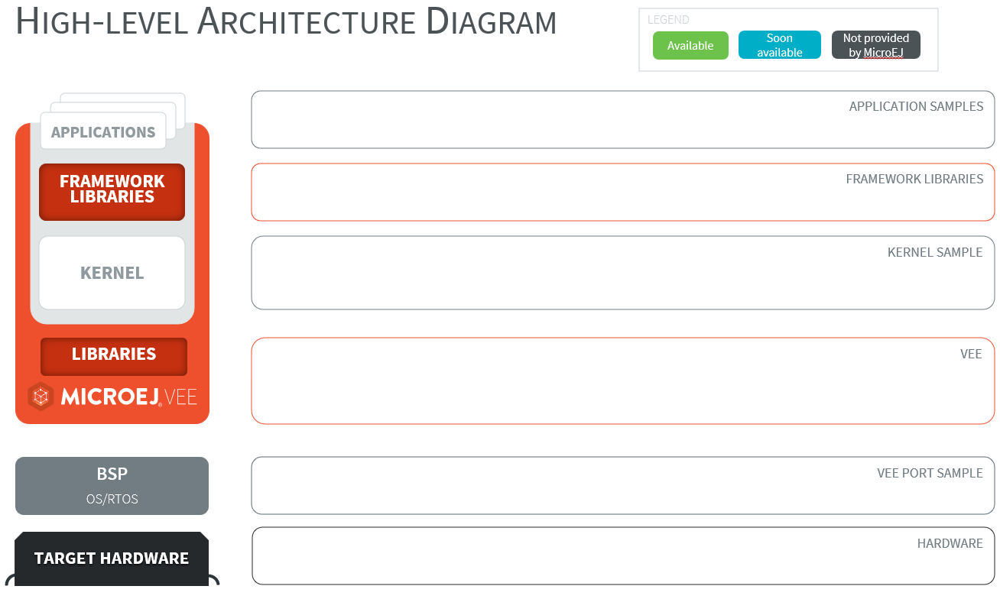

.. _introduction:

Introduction
============

Overview
--------

This Developer Package provides everything needed to use the <framework_name> Framework,
enabling developers to explore its capabilities, build custom applications, and validate them on supported targets.

The following video showcases the <framework_name> Framework:

.. raw:: html

        

                <video width="960" height="540" controls="controls" >
                        <source src="https://www.microej.com/video_link.mp4" type="video/mp4">
                </video>
        

Terms and Definitions
---------------------

- Multi-Sandbox VEE Port: a VEE Port with the `Multi-Sandbox <https://docs.microej.com/en/latest/VEEPortingGuide/multiSandbox.html>`__ capability of the Core Engine enabled.
- Kernel: a `Kernel <https://docs.microej.com/en/latest/KernelDeveloperGuide/kf.html#basic-concepts>`__ is the main application that defines the core functionality of the system. It can be extended by "Features".
- Feature: a `Feature <https://docs.microej.com/en/latest/KernelDeveloperGuide/kf.html#basic-concepts>`__  is an application "extension" managed by the Kernel. It can be installed, started, stopped, and uninstalled.
- Mock: a `Mock <https://docs.microej.com/en/latest/VEEPortingGuide/mock.html>`__ is a jar file containing the Java classes that simulate natives for the Simulator.
- Virtual Device: a `Virtual Device <https://docs.microej.com/en/latest/ApplicationDeveloperGuide/virtualDevice.html>`__ includes the same MicroEJ Core, libraries, and pre-installed Applications as the real device. The Virtual Device allows developers to run their applications on the Simulator.

Intended Audience and Knowledge Prerequisites
---------------------------------------------

This package is designed for developers and system architects who plan to design and build their own framework using <framework_name>.

This document assumes that the reader is familiar with MICROEJ SDK and MICROEJ VEE (see `our Getting Started <https://docs.microej.com/en/latest/GettingStarted/gettingStarted.html>`__)
and specifics of developing Multi-Sandbox Applications (see `our training for Multi-Sandbox Applications <https://docs.microej.com/en/latest/Trainings/gettingStartedIMXRT1170MultiSandbox.html>`__).
The reader is also encouraged to refer to the official documentation, as not all topics are covered in this documentation.

For a quick overview of an application without setting up the development environment, the package provides a Virtual Device and a prebuilt executable.
These resources enable readers to explore the application's behavior and features with minimal setup.

High-Level Architecture Diagram
-------------------------------

Below is a high-level diagram illustrating the software components:

	High-level architecture diagram

To complement the overview above, the following summarizes the main components included in the package.

- **Application Samples**: Example applications demonstrating typical use cases of the framework.
- **Libraries**: High-level functionalities providing APIs to the applications.
- **Kernel**: Kernel Application defining the system core behavior, including app management, services to apps, navigation, connectivity, and more.
- **Mock**: Project containing native functions used by the Simulator to simulate the target hardware.
- **VEE Port**: Multi-Sandbox VEE Port enabling MICROEJ VEE with all functionalities required by the framework on the target hardware.

The source code for these components is provided, allowing for testing and modification.

High-Level Functional Diagram
-----------------------------

Below is a high-level diagram illustrating the data flow between the components:

Directory Structure
-------------------

The package is structured as follows:

.. code-block:: none

    ├── bin/
        ├── executable/
            └── <target>/                            # Kernel Executable (one per target)
        └── virtualDevice/
            └── <target>/                            # Virtual Device (one per target)
    ├── doc/
        └── index.html                               # The entry point of the documentation
    ├── javadoc/
        └── index.html                               # The entry point of the javadoc
    ├── repository/                                  # Module Repository containing dependencies
    └── src/
        ├── app                                      # Application sample sources
        └── vee
            ├── kernel                               # Kernel sources (shared across targets)
            └── <target>                             # VEE Port sources (one per target)

Licensing
---------

The repository of this package is a set of modules distributed under various software licenses, including the SDK EULA and the Commercial Component License for some of them. Please consult the ``LICENSE.txt`` file attached to each module.

.. 
   | Copyright 2025-2026 MicroEJ Corp. All rights reserved.
   | MicroEJ Corp. PROPRIETARY/CONFIDENTIAL. Use is subject to license terms.